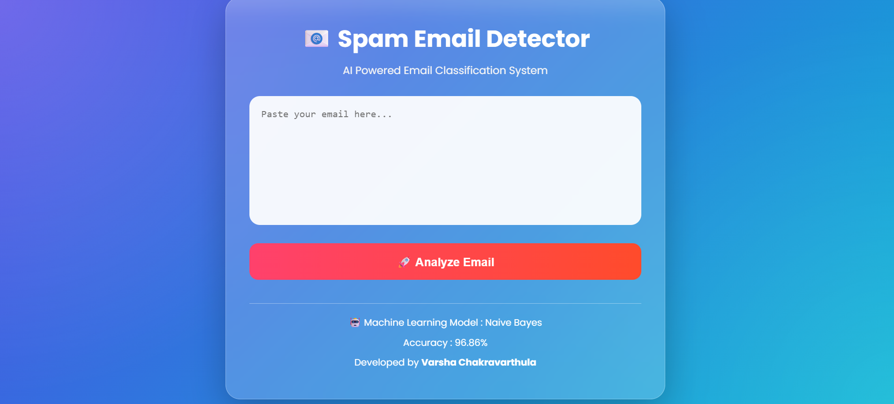
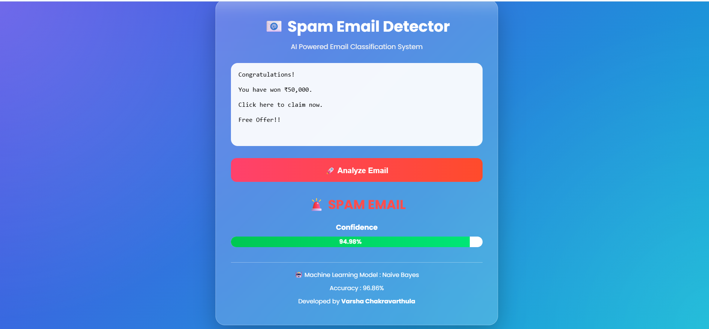
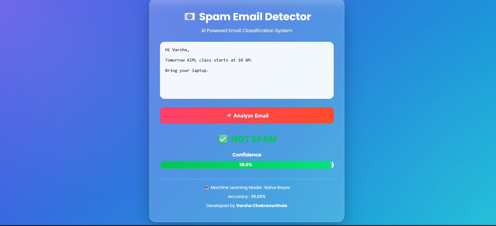

# 📧 Spam Email Detection using Machine Learning

## 📌 Project Overview

This project uses Machine Learning to classify emails as **Spam** or **Not Spam**.

The application is built using **Python**, **Flask**, **Scikit-learn**, **HTML**, and **CSS**.

---

## 🚀 Features

- Spam Email Detection
- Machine Learning Prediction
- Modern User Interface
- Confidence Score
- Responsive Design

---

## 🛠 Technologies Used

- Python
- Flask
- Pandas
- Scikit-Learn
- HTML5
- CSS3

---

## 📷 Screenshots

### Home Page



### Spam Prediction



### Not Spam Prediction



---

## ▶️ How to Run

```bash
python app.py
```

---

## 🤖 Machine Learning Algorithm

Multinomial Naive Bayes

Accuracy: **96.86%**

---

## 👩‍💻 Author

**Varsha Chakravarthula**